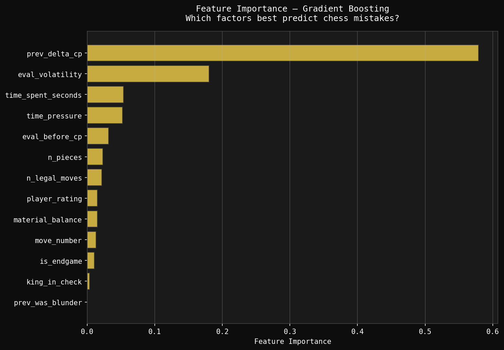
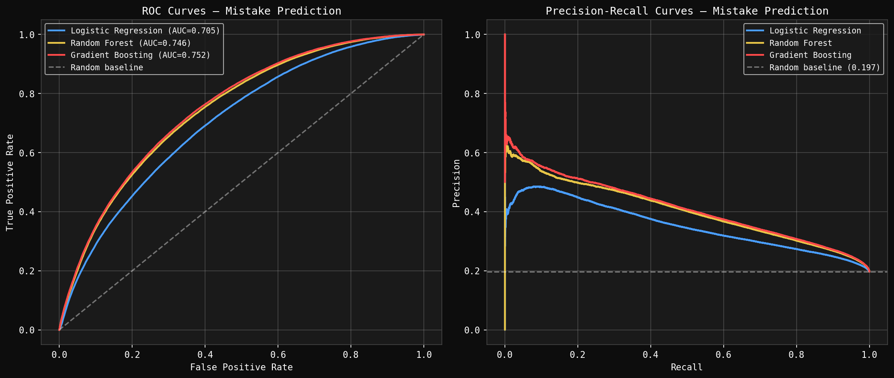

# Chess Blunder Prediction

**Research Project | Machine Learning | Behavioral Decision Science**

---

## Overview

This project investigates the causes of human error in chess and builds 
machine learning models to predict mistakes before they occur.

Chess provides a unique scientific laboratory for studying human 
decision-making under complexity. Every move has a measurable correct 
answer (via Stockfish engine evaluation), making chess one of the few 
domains where human reasoning can be compared directly to near-perfect 
play across millions of decisions.

---

## Research Questions

1. Can machine learning models predict human chess mistakes?
2. Which properties of a chess position increase the probability of error?
3. How do time pressure and position complexity interact to cause mistakes?
4. Do mistakes cascade — does one error increase the probability of another?

---

## Key Findings

| Finding | Result |
|---|---|
| Amateur blunder rate | 7.81% |
| Grandmaster blunder rate | 1.05% |
| Best model AUC-ROC | 0.7519 (Gradient Boosting) |
| Strongest predictor | Previous move evaluation delta (57.9% importance) |
| Time pressure confirmed | Top 5 feature out of 13 |
| Tilt hypothesis | Confirmed in continuous form, rejected in binary form |

---

## Dataset

- **Source:** Lichess.org public game database (February 2026)
- **Size:** 5,000 games, 333,990 moves analyzed
- **Engine:** Stockfish at depth 5 for position evaluation
- **Blunder definition:** Evaluation drop ≥ 200 centipawns

To regenerate the dataset:
```bash
python3 src/build_dataset.py
```

---

## Features Extracted

| Feature | Description |
|---|---|
| `n_legal_moves` | Branching factor — number of legal moves available |
| `eval_before_cp` | Stockfish evaluation before the move |
| `eval_volatility` | Standard deviation of last 5 evaluations |
| `time_pressure` | Clock remaining / starting time (0=no time, 1=full time) |
| `time_spent_seconds` | Seconds spent on this move |
| `prev_delta_cp` | Evaluation change on previous move |
| `prev_was_blunder` | Whether previous move was a blunder |
| `player_rating` | Lichess ELO rating |
| `material_balance` | Material advantage in centipawns |

---

## Models

| Model | F1 Score | AUC-ROC |
|---|---|---|
| Logistic Regression | 0.4157 | 0.7050 |
| Random Forest | 0.4537 | 0.7461 |
| Gradient Boosting | 0.1866 | **0.7519** |

---

## Project Structure
```
Chess_Blunder_Prediction/
├── src/
│   ├── read_games.py          # Phase 1: PGN parsing
│   ├── engine_analysis.py     # Phase 2: Stockfish evaluation
│   ├── feature_extraction.py  # Phase 3: Feature engineering
│   ├── build_dataset.py       # Phase 4: Full pipeline
│   ├── parse_lichess.py       # Clock extraction from Lichess PGN
│   └── model_training.py      # Phase 6: ML model training
├── notebooks/
│   └── exploratory_analysis.py  # EDA and visualizations
├── data/
│   └── sample_games.pgn       # Sample grandmaster games
├── results/                   # Generated visualizations
└── requirements.txt           # Python dependencies
```

---

## Installation
```bash
git clone https://github.com/Coddiwompl3r/Chess_Blunder_Prediction
cd Chess_Blunder_Prediction
pip3 install -r requirements.txt
brew install stockfish
python3 src/read_games.py
```

---

## Results




---

## Conclusions

Position evaluation momentum (`prev_delta_cp`) is the dominant predictor 
of human chess mistakes, accounting for 57.9% of model predictive power. 
Time pressure features rank in the top 5 of 13 features, confirming that 
cognitive load under time constraints significantly increases error rates.

The tilt hypothesis — that mistakes cascade — is confirmed in continuous 
form (evaluation momentum) but rejected in binary form (blunder indicator), 
suggesting that the magnitude of positional deterioration, not the 
categorical classification of a move as a blunder, drives subsequent 
mistake probability.

---

## License

MIT License — see LICENSE file